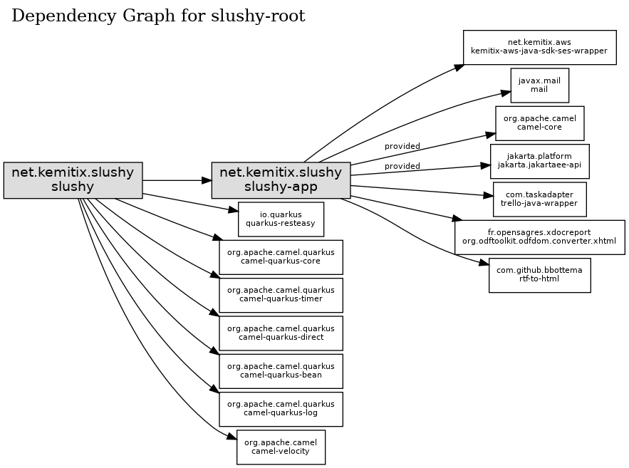

# slushy
Slushy pile agent

## Configuration

Define the following environment variables to configure Slushy:

* `TRELLO_KEY` - the Trello API access key
* `TRELLO_SECRET` - the Trello API secret key
* `SLUSHY_BOARD` - the Trello Board
* `SLUSHY_USER` - the Trello User name
* `SLUSHY_READER` - the email to send attachements to
* `SLUSHY_SENDER` - the email to send emails from and to receive cc'd copies
* `SLUSHY_CONFIG_LIST` - the Trello List to read the additional config from
* `SLUSHY_CONFIG_CARD` - the Trello Card to read the additional config from
* `SLUSHY_STATUS_LIST` - the Trello List to report the status into
* `SLUSHY_STATUS_CARD` - the Trello Card to report the status into

## Requirements

- Docker
- Trello Account
- Trello Board

The Trello Board requires the following lists, although the names can be changed
in the `src/main/resources/META-INF/microprofile-config.properties` file:

- Inbox
- Send to Reader
- Slush
- Reject
- Rejected
- Hold
- Held
- Withdraw

## Workflow

The following is a summary, but details are customisable by updating the various `slushy.*.routing-slip` entries in the `microprofile-config.properties` file.

New submissions are added to the _Inbox_ list as a Card using the Trello Board's custom `send to board` email address.
The card is validated and a precis insert at the start of the Card's description.
The Card, if valid, and email is sent to the author, and it is then moved to the _Send to Reader_ list.
For Cards that fail validation, an email is sent to the author and the Card is moved to the _Rejected_ list.

Cards are taken from the _Send to Reader_ list and converted, using Calibre, into Mobi format and sent to the `SLUSHY_READER` email address, presumably the address for a Kindle device.
The Card is then moved to the _Slush_ list.
The setting `slushy.reader.max-size` within the properties file determines the maximum number of cards that will be added to the _Slush_ list at any one time.
If there is no space in the _Slush_ list, then no cards are taken from the _Send to Reader_ list until there is.

Cards added to the _Reject_ list will, after they have not been further updated for `slushy.reject.required-age-hours` hours, be moved to the _Rejected_ list after sending an email to the author.
This is considered 'resting' and allows for mistakes and changing of minds.

Similarly, cards added to the _Hold_ list will be moved to the _Held_ list.
Again, after `slushy.hold.required-age-hours` hours, and then the sending of an email.

Cards added to the _Withdraw_ list are archived from the Trello Board after sending a confirmation email to the author.

The Trello Board can have additional lists to manage the cards.
Those additional lists are ignored by Slushy, unless they are included in `slushy.multisub.lists` to count against multiple submissions.
For example: _To Re-read_

## Structure/Dependencies

