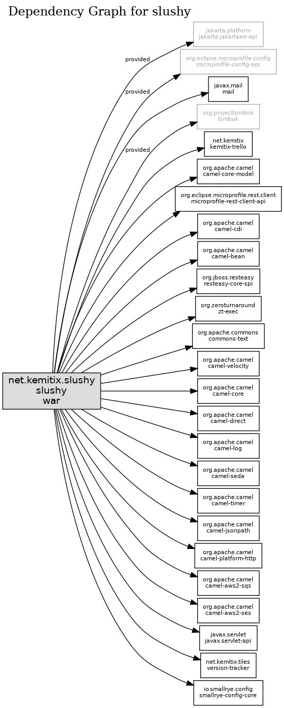

# slushy
Slushy pile agent

# Configuration

Define the following environment variables to configure Slushy:

* `TRELLO_KEY` - the Trello API access key
* `TRELLO_SECRET` - the Trello API secret key
* `SLUSHY_BOARD` - the Trello Board
* `SLUSHY_USER` - the Trello User name
* `SLUSHY_READER` - the email to send attachements to
* `SLUSHY_SENDER` - the email to send emails from and to receive cc'd copies
* `SLUSHY_CONFIG_LIST` - the Trello List to read the additional config from
* `SLUSHY_CONFIG_CARD` - the Trello Card to read the additional config from
* `SLUSHY_STATUS_LIST` - the Trello List to report the status into
* `SLUSHY_STATUS_CARD` - the Trello Card to report the status into

# Structure/Dependencies

